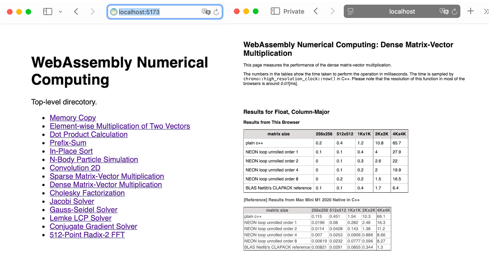

# WebAssemblyNumericalComputing

A study on the numerical computing with WebAssembly in C++ on the web browsers



# Run the Test Scripts on Your Browser
You can run the test scripts on your browser.
You need to run a local server, such as `http.server` in Python3.
The `./public` directory contains all the necessary files (*.html, *.css, *.js, *.wasm. *.data ) for the local HTTP server.

For example:
```
$ git clone git@github.com:ShoYamanishi/WebAssemblyNumericalComputing.git
$ cd WebAssemblyNumericalComputing/public
$ python3 -m http.server 5173  
Serving HTTP on :: port 5173 (http://[::]:5173/) ...
```

Then open 'http://localhost:5173/' on your browser.
This will get you the top-level page, which contains the links to the actual test pages.
Clicking on one of those links will open a page for the specific type of computation.
The page automatically starts the test script to measure the performance.

The test script is written in C++ and compiled to WASM by Emscripten.
When it finishes, the page will update the tables with the times measured in milliseconds in the tables.

Each table is accompanied by a smaller table below it.
The smaller table contains the numbers sampled from the test program compiled
from the same C++ code by clang++, and natively executed on Mac Mini M1 2020.
You can make the side-by-side comparison of the time taken on your browser and on the Mac for each problem type and the size.

# Description
This is a collection of scripts that perform some representative numerical computations on the web browsers. The scripts are written in C++ with NEON SIMD intrinsics where applicable. The C++ codes are compiled to WASM, and then linked to HTML files with
some glue code in JS. The C++ codes utilize the following libraries where applicable, as well as the C++ standard library.

- [Boost](https://www.boost.org).
- [Eigen3](https://gitlab.com/libeigen/eigen).
- [BLAS routines from CLAPACK's reference implementation from Netlib](https://www.netlib.org/clapack/).

When you open one of the HTML files through a HTTP request on a browser, it will
automatically load the WASM code and starts executing it to measure the performance.
When it finishes its execution, the tables on the HTML page are updated and filled with
numbers in milliseconds.
Most of the test data are artificially generated at runtime on the browser by the random number generators except for the LCP, for which some data sampled from the real rigid body simulations are used.

The types of the computation and the problem sizes are chosen to reflect the typical real use cases in the interactive UI applications such as games.
Therefore, the use cases such as training of large machine language models, or large scale computer simulations are not considered.

Following topics are covered in this project.

- Memory copy
- Element-wise multiplication of two vectors
- Dot product calculation
- Prefix-sum
- In-place sort
- N-body particle simulation
- Convolution 2D
- Sparse matrix-vector multiplication
- Dense matrix-vector multiplication
- Cholesky factorization
- Jacobi solver
- Gauss-Seidel solver
- Lemke LCP solver
- Conjugate gradient solver
- 512-point radix-2 FFT

The GPU capacity available through WebGPU and WebGL is not considered at moment
for the following reason.

Based on my experience, the applicability of GPGPU is limited to the following types
of computations.

- N-Body-type particle simulation, GPU-based collision detection, and shader-based artistic rendering.
- Forward and back-prop for the NN learning.

The former is characterised by their high independence of the computations.
The update of the phase space for each particle does not depend on any other
computations. The latter is characterised by the 
series of matrix-matrix multiplications and additions, and element-wise function evaluations for the activation layers, where most of the data can be kept
in the GPU memory.

The former is already popular and covered by many web pages and examples, many of
which render stunningly beautiful animating graphics, and this project does not have
to cover it. The latter is not a realistic use case on the web browser.

In general, for the other types of computations on GPU, the problem sizes must be significantly large enough to be able to amortize the overhead of the GPU invokation and take
advantage of its parallelism, and for those large problem sizes, the time taken for the computation, either by CPU or GPU will be too long (in seconds and minutes) to be useful for the interactive applications.

If you are interestedin the numerical computing on Mac and iOS devices,
please check my sister project [AppleNumericalComputing on Github](https://github.com/ShoYamanishi/AppleNumericalComputing).
It utilizes Accelerate framework and Metal (GPU) compute shaders, as well as Arm NEON SIMD, and CPU multi-threadding.

# C++ Implementations

### Memory Copy
This is a simple copy of the content of a region in memory to another non-overlapping region.
Following implementations are tested.

- plain implementation in C++.
- memcpy()

The C++ test code is found in [src/test_memcpy.cpp](src/test_memcpy.cpp).

### Element-wise Multiplication of Two Vectors
This is the saxpy/daxpy type of operation. Each element-wise multiplication is totally
independent from the others. This operation can be maximally parallelized.

Following implementations are tested.

- plain implementation in C++.
- C++ with NEON SIMD.
- [the reference implementation of saxpy/daxpy from CLPACK on Netlib](https://www.netlib.org/clapack/).

The C++ test code is found in [src/test_saxpy.cpp](src/test_saxpy.cpp).

### Dot Product Calculation
This is the inner product operation for two vectors in various sizes.

Following implementations are tested.

- plain implementation in C++.
- C++ with NEON SIMD.
- [the reference implementation of sdot/ddot from CLPACK on Netlib](https://www.netlib.org/clapack/).

The C++ test code is found in [src/test_dot.cpp](src/test_dot.cpp).

### Prefix-Sum
This is a scanning operation, which can be partially parallelized.

Following implementations are tested.

- plain implementation in C++.
- std::inclusive_scan()

The C++ test code is found in [src/test_prefix_sum.cpp](src/test_prefix_sum.cpp).

### In-Place Sort
This is for the in-place sorting algorithms.

Following implementations are tested.

- std::sort()
- boost::sort::spreadsort()
- boost::sort::block_indirect_sort()

The C++ test code is found in [src/test_sort.cpp](src/test_sort.cpp).

### N-Body Particle Simulation
This is for the performance of one step for the N-Body simulation,
where each of N objects interacts with all the other N - 1 objects.
It simulates a simplified particle physics simulation in 3D.
At each step, for each particle, N-1 forces are collected based on its distances to the others,
and the velocity and the position are updated by a simple Euler step.

Following implementations are tested.

- plain implementation in C++ with the 'array of structures' data arrangement.
- plain implementation in C++ with the 'structure of arrays' data arrangement.
- C++ with NEON SIMD with the 'structure of arrays' data arrangement.

The C++ test code is found in [src/test_nbody.cpp](src/test_nbody.cpp),
 [src/nbody_elements_impl.h](src/nbody_elements_impl.h), and
 [src/nbody_elements.h](src/nbody_elements.h).

### Convolution 2D
This is for the 2D filtering operation with the convolution with a 5x5 kernel.
This type of operation is usually done with GPU, but this topic may be still
useful to get some rough idea about what kind of performance you can get on the browser
for this type of operations. Only a plain implementation in C++ is considered.

The C++ test code is found in [src/test_convolution_2d.cpp](src/test_convolution_2d.cpp).

### Sparse Matrix-Vector Multiplication
This is for the performance of the sparse matrix-vector multiplication, where the matrix
elements are stored in the CSR (compressed sparse row) form. Only a plain implementation in C++ is considered.

The C++ test code is found in [src/test_sparse_matrix_vector.cpp](src/test_sparse_matrix_vector.cpp).

### Dense Matrix-Vector Multiplication
This is for the performance of the dense matrix-vector multiplication.

Following implementations are tested.
- plain implementation in C++.
- C++ with NEON SIMD.
- [the reference implementation of sgemv/dgemv from CLPACK on Netlib](https://www.netlib.org/clapack/).

The C++ test code is found in [src/test_dense_matrix_vector.cpp](src/test_dense_matrix_vector.cpp).

### Cholesky Factorization
This is for the performance of the inverse operation for the PD matrices with
Cholesky factorization.

Following implementations are tested.
- plain implementations in C++.
- [Eigen::LLT from Eigen3](https://eigen.tuxfamily.org/dox/classEigen_1_1LLT.html).

The C++ test code is found in [src/test_cholesky.cpp](src/test_cholesky.cpp),
[src/test_case_cholesky_baseline.h](src/test_case_cholesky_baseline.h), and
[src/test_case_cholesky_eigen3.h](src/test_case_cholesky_eigen3.h).

### Jacobi Solver
This is for the performance of the iterative Jacobi solver.
The number of iterations is fixed to 10.

Following implementations are tested.
- plain implementations in C++.
- C++ with NEON SIMD.

The C++ test code is found in [src/test_jacobi_solver.cpp](src/test_jacobi_solver.cpp).

### Gauss-Seidel Solver
This is for the performance of the iterative Gauss-Seidel solver.
The number of iterations is fixed to 10.

Following implementations are tested.
- plain implementations in C++.
- C++ with NEON SIMD.

The C++ test code is found in [src/test_gauss_seidel_solver.cpp](src/test_gauss_seidel_solver.cpp).

### Lemke LCP Solver
This is for the performance of the Lemke LCP (Linear Complentarity Problem) solver.
The number of pivots can not be fixed, but the input data have been sampled from a velocity-space constraint-based real rigid body simulation with the hexagonal friction cone.

Following implementations are tested.
- plain implementations in C++.
- C++ with NEON SIMD.

The C++ test code is found in [src/test_lcp.cpp](src/test_lcp.cpp),
[src/test_case_lcp_lemke_baseline.h](src/test_case_lcp_lemke_baseline.h),
[src/test_case_lcp_lemke_neon.h](src/test_case_lcp_lemke_neon.h), and
[src/test_case_lcp.h](src/test_case_lcp.h), and

### Conjugate Gradient Solver
This is for the performance of the conjugate gradient solver.
The test data are artifically generated with the condition numbers of 10.0, 1000.0, and 100000.0. Only a plain implementation in C++ is considered.

The C++ test code is found in [src/test_conjugate_gradient_solver.cpp](src/test_conjugate_gradient_solver.cpp).

### 512-Point Radix-2 FFT
This is for the performance of the 512-point radix-2 FFT.
This type of operation is usually done with a DSP, but this topic may be still
useful to get some rough idea about what kind of performance you can get on the browser
for this type of operations. Only a plain implementation in C++ is considered.

The C++ test code is found in [src/test_fft.cpp](src/test_fft.cpp).

# Build
If you want to build the contents (WASM, JS, HTML, and CSS) in the [public/](public/) directory from the
C++ files, you can use the following instruction.

## Requirements:

### Emscripten

Follow the instruction in [the official page](https://emscripten.org/).

### Eigen3 (used for Cholesky factorization)
You can skip this step, if you don't want to run the tests for Cholesky factorization.

- Download the zip file from the following official location:
 https://gitlab.com/libeigen/eigen/-/releases/3.4.0 on Gitlab.

- Install it to Emscripten as follows.

```
% source <path/to>/emsdk_env.sh
% cd <path/to>eigen-3.4.0
% mkdir build 
% cd build
% emcmake cmake -DCMAKE_BUILD_TYPE=Release ..
% cmake --build . --target install
```

## Build
Run the build script [build.sh](build.sh).
```
% source <path/to>/emsdk_env.sh
% cd <path/to>WebAssemblyNumericalComputing
% ./build.sh
```
It's a small convenience script to invoke emcc to compile the c++ files to WASM.
This will arrange all the necessary files in [public/](public/).

# Build for Native MacOS.

You can run the same c++ test programs on an MacOS for ARM.
They have the following dependencies.

- [Eigen3](https://eigen.tuxfamily.org/dox/) used by [src/test_cholesky.cpp](src/test_cholesky.cpp).
- [Boost](https://www.boost.org/) used by [src/test_sort.cpp](src/test_sort.cpp).


## Build
Run the build script [build_native_macos.sh](build_native_macos.sh).
```
% cd <path/to>WebAssemblyNumericalComputing
% ./build_native_macos.sh
```
This will generate the binaries in `native_output/`.
The boost library is assumed to be installed at `/opt/homebrew/include`.

It's a small convenience script to invoke clang++. It should work
on any other ARM environment that has a LLVM, Eigen3, and Boost after adjusting the include paths if necessary.


